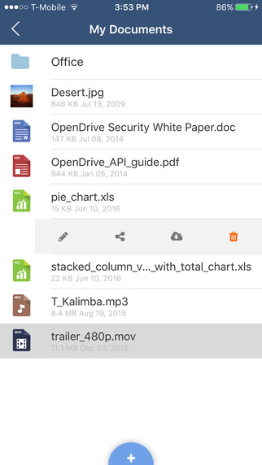
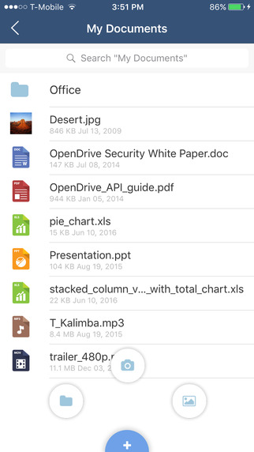

# OpenDrive

Store, sync or backup your documents, music and pictures online with instant access, sharing and collaboration, all in a simple to use, secure environment.

In a simple but effective interface, create notepads with single notes and to-do lists. Attach pictures and documents to any note and write comments.

A powerful task and project management tool that helps you manage and collaborate on any project within a single interface. Share tasks with your account users or anyone else.

* Upload and Preview Files
* Upload Selected Files
* Upload New File Versions
* Serch for Files and Folders
* Send Files by Email
* Store Files for Offline Access
* Access Shared Folders
* Copy Links to Clipboard
* Play Music and Videos
* Play Next Song in Audio Player
* Play Music in Background
* Keep Me Logged In
* Passcode Lock
